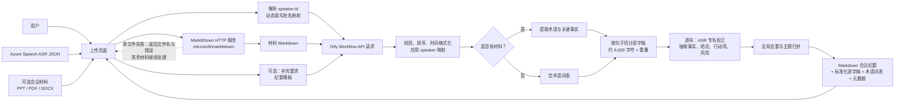

# 长会议纪要：Dify Workflow 套件

本套件面向 Dify `1.15.0` 自建环境，处理 Azure Foundry AI Speech 产生的多说话人 ASR JSON，并用 Azure OpenAI 部署 `gpt-5.4` 输出结构化会议纪要。

## 交付内容

- `dify/long-meeting-summary.yml`：可导入的 Dify Workflow DSL。
- `frontend/index.html`：由 Nginx 通过 HTTP 端口 `4321` 提供的上传页；本地读取转写 JSON、自动识别 speaker 并动态填写姓名映射。
- `services/markitdown-service/`：基于 [microsoft/markitdown](https://github.com/microsoft/markitdown) 的内部 HTTP 服务，将 PPT/PDF/DOCX 转为 Markdown。
- `docs/frontend-integration.md`：动态说话人命名页面与 Dify 调用契约。
- `docs/deployment.md`：单容器 Docker、Dify 导入和模型配置说明。
- `docs/dify-import-troubleshooting.md`：Dify 1.15 DSL 导入失败时的日志获取与修复步骤。
- `docs/dify-output-troubleshooting.md`：Workflow 已运行但 End 节点未返回 `final_minutes` 时的排查步骤。
- `docs/vm-nginx-proxy-deployment.md`：Azure Ubuntu VM 上 Nginx HTTP（端口 `4321`）直接代理 Dify 与私有 MarkItDown 的部署说明。
- `docs/dify-api-bridge.md`：不修改 Dify Docker Compose 时，将 Dify 内部 `api:5001` 私有桥接到 VM `127.0.0.1:2222` 的部署说明。
- `tests/`：基于所给 Azure Speech JSON 结构的离线验证脚本与样例。

## 快速开始

1. 所有 Python 依赖都必须安装在虚拟环境中。若在本地运行或验证服务，先执行：

   ```bash
   python3 -m venv .venv
   .venv/bin/python -m pip install --upgrade pip
   .venv/bin/python -m pip install -r services/markitdown-service/requirements.txt
   ```

2. 在 Dify 的模型供应商页面配置 Azure OpenAI，并确认 Provider 标识为 `azure_openai`、部署名为 `gpt-5.4`。
3. 使用单容器 `docker run -d` 部署 `markitdown-service`（详见 `docs/deployment.md`）；无需运行 Docker Compose。Docker 镜像会在容器内创建并使用 `/opt/venv`。
4. 导入 `dify/long-meeting-summary.yml`。如果当前 Dify 安装的 Azure OpenAI Provider 内部标识与 DSL 不同，只需在三个 LLM 节点重新选择同一部署。
5. 实现或接入上传页。页面先将会议材料转为 Markdown，再调用 Dify Workflow API；完整请求字段见 `docs/frontend-integration.md`。

> 部署到 Azure VM 时，页面通过 Nginx 同域代理调用 Dify 和私有 MarkItDown。页面会先在浏览器本地解析 JSON，识别 speaker 后显示姓名输入框；Dify API Key 仅存在于 Nginx 的 root-only 配置文件中，不暴露给浏览器。

## 数据流



材料转换引擎使用开源的 [microsoft/markitdown](https://github.com/microsoft/markitdown) Python 包；本项目的服务只负责文件类型、大小和超时控制，并将转换结果提供给上传页面。Dify 工作流不会直接获取或持久化原始材料文件。

## 工作流输入

| 字段 | 必填 | 说明 |
| --- | --- | --- |
| `transcript_json` | 是 | Azure Speech 顶层数组 JSON 原文。 |
| `speaker_mapping_json` | 是 | JSON 对象，如 `{"1":"面试官","2":"候选人"}`。 |
| `material_markdown` | 否 | 由 MarkItDown 转换并合并后的材料 Markdown。 |
| `meeting_template` | 是 | `标准三段式纪要`、`通用会议纪要`、`访谈面试复盘` 或 `项目周会`。 |
| `user_context` | 否 | 会议背景、关注点和额外要求。 |

## 约束

- Dify Start 表单无法在用户上传 JSON 后动态增加输入框。因此动态说话人改名由外部上传页完成，并作为 `speaker_mapping_json` 传入。
- 长转写在工作流中先按句子边界、约 9,000 字符切分并带尾部重叠，再通过 Iteration 节点依序抽取块级事实，避免直接把 1–2 小时原文塞入单次模型调用。
- 文档转换服务设计为内网服务；不要将其无鉴权地公开到公网。
