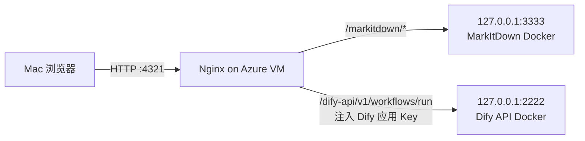

# Azure Ubuntu VM 部署（Nginx 直接代理，HTTP 端口 4321）

> **警告：HTTP 不加密传输。** Basic Auth 密码、转写 JSON、PPT/PDF 和纪要内容在网络中均可能被读取或篡改。仅限 VPN、可信内网或测试使用；公网生产环境请改用 HTTPS。

此版本不使用 Python 网关。浏览器在本地读取 JSON 并识别 speaker；Nginx 作为同域代理：



## 1. 停止并移除旧网关

如果此前部署过 `meeting-summary-gateway`，它不再需要：

```bash
sudo systemctl disable --now meeting-summary-gateway
sudo rm -f /etc/systemd/system/meeting-summary-gateway.service
sudo systemctl daemon-reload
```

端口 `4322` 不再使用，不要在 Azure NSG 或 UFW 中开放它。

## 2. 确保 MarkItDown 私有运行

无需更改当前 MarkItDown 镜像。只需确保容器端口保持回环绑定：

```bash
docker ps --filter name=markitdown-service
curl http://127.0.0.1:3333/healthz
```

预期 Docker 端口列显示：`127.0.0.1:3333->3333/tcp`。不要开放 `3333` 到公网。

## 3. 安装页面与 Nginx 配置

在 VM 上执行：

```bash
cd /data/asr_summary

sudo install -d -m 0755 /var/www/meeting-summary
sudo install -m 0644 frontend/index.html /var/www/meeting-summary/index.html

sudo install -m 0644 nginx/meeting-summary.conf /etc/nginx/sites-available/meeting-summary
sudo sed -i 's/YOUR_DOMAIN/20.171.8.48/g' /etc/nginx/sites-available/meeting-summary
sudo ln -sf /etc/nginx/sites-available/meeting-summary /etc/nginx/sites-enabled/meeting-summary
```

如 Ubuntu 默认站点监听宿主机 `80`，会与 Dify Docker Nginx 的 `80` 冲突；禁用它：

```bash
sudo rm -f /etc/nginx/sites-enabled/default
```

## 4. 将 Dify API 私有映射到 VM 的 2222 端口

### 方式 A：不修改 Dify Compose（推荐）

运行独立桥接容器，把 Dify Docker 网络内的 `api:5001` 私有桥接为 VM 的 `127.0.0.1:2222`。这不会修改 Dify 镜像、Compose 文件或现有容器。完整命令见 `docs/dify-api-bridge.md`。

### 方式 B：修改 Dify Compose

在 **Dify Docker Compose 项目目录**（即运行 `docker-api-1` 的目录，不是本项目的 `/data/asr_summary` 目录）编辑 Dify 的 `docker-compose.yaml`。在 `api:` 服务下加入：

```yaml
services:
  api:
    ports:
      - "127.0.0.1:2222:5001"
```

`5001` 是 Dify API 容器内部端口；绑定格式中的左侧 `127.0.0.1:2222` 只在 VM 本机可访问，**不要**写成 `0.0.0.0:2222:5001`。

保存后在 Dify Docker Compose 目录重建 `api` 容器：

```bash
docker compose up -d --force-recreate api
docker compose ps api
```

验证私有 API 映射：

```bash
curl -i http://127.0.0.1:2222/health
curl -i -X POST http://127.0.0.1:2222/v1/workflows/run
```

第一个请求应返回 `200`。第二个请求因未附应用 API Key，预期返回 `401`、`400` 或 `422`；**不能返回 `404`**。端口 `2222` 不需要、也不应在 Azure NSG/UFW 开放。

会议页面 Nginx 的 Dify 上游已配置为：

```nginx
proxy_pass http://127.0.0.1:2222/v1/workflows/run;
```

在 Dify 中发布 Workflow 后，到应用的 API Access 页面创建应用 API Key（通常以 `app-` 开头）。不要把它放进 HTML 或浏览器。

创建 Nginx 专用 include 文件：

```bash
sudo sh -c 'printf "%s\n" "proxy_set_header Authorization \\\"Bearer app-替换为真实应用APIKey\\\";" > /etc/nginx/meeting-summary-dify-key.conf'
sudo chown root:root /etc/nginx/meeting-summary-dify-key.conf
sudo chmod 0600 /etc/nginx/meeting-summary-dify-key.conf
```

检查文件内容时避免在共享终端、截图或日志中泄露完整 Key：

```bash
sudo stat /etc/nginx/meeting-summary-dify-key.conf
```

## 5. 配置 Basic Auth 并启动 Nginx

```bash
sudo apt update
sudo apt install -y nginx apache2-utils
sudo htpasswd -c /etc/nginx/.htpasswd-meeting-summary azureuser

sudo nginx -t
sudo systemctl enable --now nginx
sudo systemctl restart nginx
```

在 VM 本机测试：

```bash
curl -I http://127.0.0.1:4321/
```

预期返回 `401 Unauthorized`，说明 Basic Auth 已生效。浏览器入口：

```text
http://20.171.8.48:4321/
```

## 6. 网络和排查

- Azure NSG/UFW 只开放 `4321/tcp` 给办公出口 IP 或 VPN 网段；不要对公网开放 `2222`、`3333`、`4322` 或 Dify 内部端口。
- 每次修改 `frontend/index.html` 后执行 `sudo install -m 0644 frontend/index.html /var/www/meeting-summary/index.html`，并在浏览器使用强制刷新。
- 页面点击“生成纪要”时，在 VM 上观察：

```bash
sudo tail -f /var/log/nginx/access.log /var/log/nginx/error.log
```

预期看到依次出现：

```text
POST /markitdown/v1/convert
POST /dify-api/v1/workflows/run
```

如果日志只有 `GET /` 而没有上述 `POST`，在 Mac 浏览器按 `Option + Command + I` 打开 **Console**。若看到 `Refused to execute inline script because it violates Content Security Policy`，说明 Nginx 尚未加载本项目更新后的 CSP 配置；重新复制配置、执行 `sudo nginx -t` 和 `sudo systemctl restart nginx`。

此站点有独立日志，优先查看：

```bash
sudo tail -f /var/log/nginx/meeting-summary-access.log /var/log/nginx/meeting-summary-error.log
```

- 若出现 `POST /dify-api/v1/workflows/run` 但 Dify 监控仍是 0，重点检查：

```bash
sudo nginx -t
sudo tail -n 100 /var/log/nginx/error.log
curl -i -X POST http://127.0.0.1:2222/v1/workflows/run
```

最后一个 `curl` 未附 API Key 时应返回 API 的 `401`/`400`/`422`，而不是 `404` 或 HTML 页面。若返回 `404`，检查 Dify Compose 中 `api:` 服务的端口映射是否应用成功。
